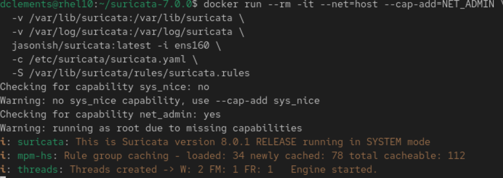
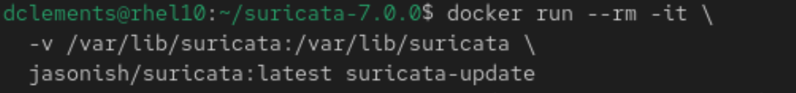
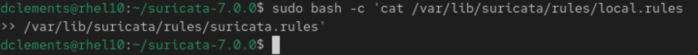
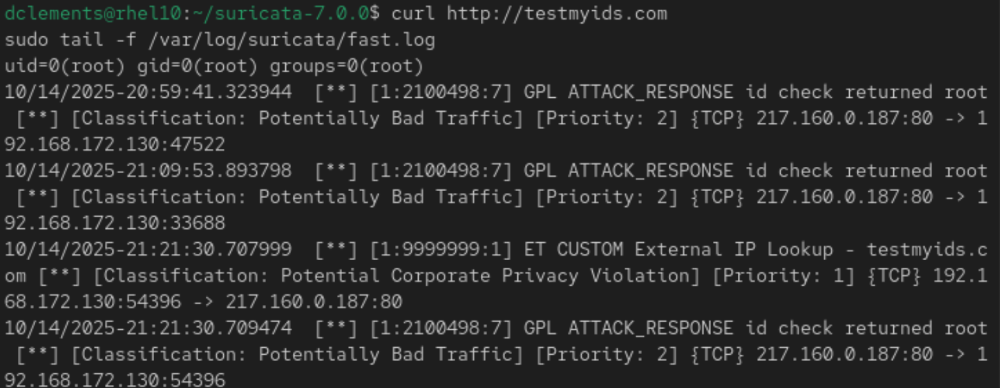
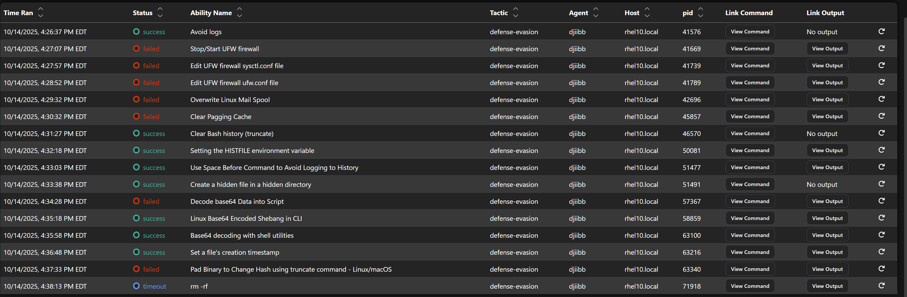

# 🛡️ Suricata Detection: External IP Lookup

## 🧠 Overview
This project demonstrates live packet inspection using Suricata in Docker, rule injection, and alert validation. It includes a custom rule for `testmyids.com` and confirms detection via `fast.log`.

## 📸 Suricata Detection Pipeline Artifacts

Below are key screenshots captured during the Suricata lab deployment and validation process:

### 🧱 Suricata Container Launch


### 🔄 Rule Update Confirmation

.png)

### 🧩 Merge Custom Rule into Active Ruleset


### 🚨 Alert in fast.log



### 🕵️ Caldera Timeline



## 🔗 GitHub Repository
➡️ [View on GitHub](https://github.com/DevinClements/suricata-detection)

## 🛠️ Environment
- **Interface**: `ens160`
- **Container**: `jasonish/suricata:latest`
- **Rule Source**: `suricata-update` (ET + GPL)
- **Custom Rule**: `testmyids.com` (SID: 9999999)

## 🚀 Setup Commands

### Update Rules
```bash
docker run --rm -it \
  -v /var/lib/suricata:/var/lib/suricata \
  jasonish/suricata:latest suricata-update


